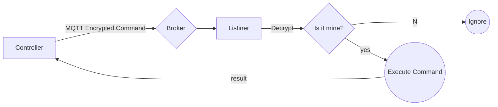

## Installation

### Listiner 
```
git clone https://github.com/alrifaii/MAMSUS --depth=1 --branch=main --single-branch MAMSUS_Listiner

```

Lisitner (slave)

    
    
    What is the difference between MAMSUS_Controll and MAMSUS_Listiner?

    How do I set up MAMSUS_Controll on the main computer?

    What steps are involved in deploying MAMSUS_Listiner on remote computers?

    Can MAMSUS_Listiner be implemented on multiple PCs simultaneously?

    Are there any network or firewall considerations for using MAMSUS_Controll and MAMSUS_Listiner across different computers?

    How is the communication between MAMSUS_Controll and MAMSUS_Listiner secured?

    Is there a user authentication process to ensure secure connections between the controlling and controlled computers?

    Can MAMSUS_Controll and MAMSUS_Listiner be used across different operating systems?

    What level of control does MAMSUS_Controll provide over the remote computers running MAMSUS_Listiner?

    Are there any specific use cases or scenarios where MAMSUS_Controll and MAMSUS_Listiner excel?


> **Note:** The **Publish now** button is disabled if your file has not been published yet.

## Funktion



> **Note:** Getting Screenshot sends multiple Results.
