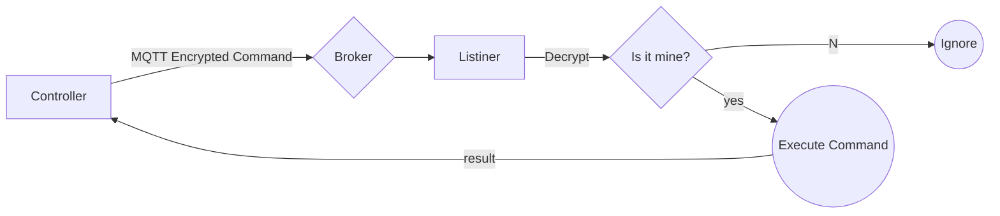

# MAMSUS (Multi-Agent Multi-System Universal System)

MAMSUS is an open-source program designed to control multiple PCs which have the 'MAMSUS Listener' program running in the background. The program utilizes PowerShell and Python commands transported via MQTT (Message Queuing Telemetry Transport).

## Features

- **User-Friendly Interface:** MAMSUS is unique for its intuitive GUI making it easy for users to interact with.
- **Cross-Device Control:** It can control multiple devices simultaneously, providing a seamless experience for managing multiple PCs.
- **MQTT Integration:** The program utilizes the "broker.mqttdashboard.com" MQTT broker, enabling control of any PC in the World with the correct password and topic.
- **Versatile Functions:**
  - Capture Screenshots
  - Get Basic System Information
  - Change Background
  - Send Key Inputs: Send keyboard inputs remotely to target devices.
  - Execute PowerShell Commands: Send PowerShell commands and receive responses from target devices.

## Compatibility

MAMSUS is specifically designed to work on Windows devices.

## Getting Started

To start using MAMSUS, follow these steps:

1. Install the "MAMSUS Listener" program on the target Windows devices.
```
git clone https://github.com/alrifaii/MAMSUS --depth=1 --branch=main --single-branch MAMSUS_Listiner

```
2. Change the Value of secret.key : This will be your Password
3. Change the value of topic.key: This will be the topic through which encrypted communication will occur. It's recommended to make this name unique.
   

## Dependencies

- Python
- MQTT broker (e.g., broker.mqttdashboard.com)

## Usage

Refer to the documentation for detailed instructions on how to use MAMSUS and its various features.

## Contributing

Contributions are welcome! Feel free to submit bug reports, feature requests, or pull requests via GitHub.


> **Note:** The **Publish now** button is disabled if your file has not been published yet.

## Funktionmap



> **Note:** Getting Screenshot sends multiple Results.
